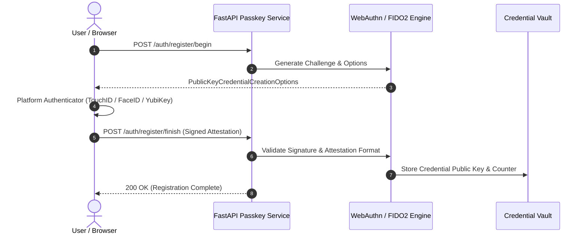

# 🔑 Auth Passkey Service

```mermaid
sequenceDiagram
    autonumber
    actor User as User / Browser
    participant API as FastAPI Passkey Service
    participant FIDO as WebAuthn / FIDO2 Engine
    participant DB as Credential Vault

    User->>API: POST /auth/register/begin
    API->>FIDO: Generate Challenge & Options
    FIDO-->>User: PublicKeyCredentialCreationOptions
    User->>User: Platform Authenticator (TouchID / FaceID / YubiKey)
    User->>API: POST /auth/register/finish (Signed Attestation)
    API->>FIDO: Validate Signature & Attestation Format
    FIDO->>DB: Store Credential Public Key & Counter
    API-->>User: 200 OK (Registration Complete)
```

Passwordless WebAuthn / Passkeys authentication microservice in Python & Docker.